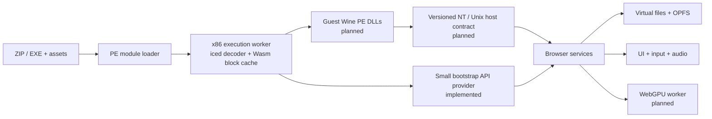

# Architecture: executing more Windows PE programs

## Scope and current state

WineBrowser is an experimental x86 PE32 runner. It maps one executable into a bounded guest
address space, decodes x86 instructions with iced-x86, and emits WebAssembly for basic blocks as
they execute. The CPU and PE loader live in [`src/cpu.js`](../src/cpu.js) and
[`src/pe.js`](../src/pe.js); [`src/runtime.js`](../src/runtime.js) resolves a small set of
imported Win32 functions to JavaScript host services. The worker owns execution; the page
handles dialogs, audio activation, and output in [`src/worker.js`](../src/worker.js) and
[`src/main.js`](../src/main.js).

This is a direct, dynamic translation path. It does not contain Theseus, use Theseus output,
load Wine, or translate only a known game's image ahead of time. It currently accepts PE32
executables, rejects DLL images, TLS and delay-import directories, and stops on unsupported
instructions or imports. It is not a Wine implementation and does not claim general Windows
compatibility.

The immediate goal should be controlled support for more ordinary PE programs while keeping
guest-visible behavior explicit. Expand support behind tests for representative binaries and
APIs; every feature needs a tested boundary and a useful failure when absent.

## Reuse choices

**Guest PE DLLs** should eventually load as guest modules. Their machine code remains x86 and
executes on the same guest CPU as the EXE. The loader must map sections, apply relocations,
resolve imports/exports, run initialization callbacks, preserve module identity, and track
references. A DLL's exports are guest addresses, not JavaScript functions. This approach
preserves the executable's expected calling conventions and lets DLL-to-DLL calls remain
ordinary guest calls, but it depends on a loader and CPU capable of the code those DLLs contain.

**Portable C libraries compiled to WebAssembly** are different. They can implement host-side
services such as a codec, a shader translator, or a carefully isolated compatibility helper.
Their C ABI crosses a host boundary; it does not make an x86 Windows DLL loadable. A wrapper
must marshal values and buffers between guest memory and the library, map errors and lifetime
rules, and avoid leaking host pointers into guest state. Compile only components with understood
browser-compatible dependencies and licenses.

For either implementation, guest callbacks must use the guest's x86 execution path. An imported
service that receives a callback address needs a trampoline that saves guest CPU state, enters
the same dispatcher at that guest address with the correct stack and calling convention, then
resumes the host operation with the guest return value. Calling a host Wasm function directly
with a guest address or assuming the host's native ABI matches stdcall is incorrect. Re-entry
through an asynchronous browser prompt needs explicit suspension/resumption rules as well.

## NT and Unix host boundary

Wine separates Windows-facing PE DLLs from Unix-side implementations through defined Unix
library calls. WineD3D itself has internal adapter/resource/shader interfaces, but its build
also depends on Unix-side integration and graphics backends; those interfaces are seams to
study, not a ready-made browser core. See the pinned [WineD3D
build](https://github.com/wine-mirror/wine/blob/bd0f453b7bb4e16c3b4ef271b3df499c34fbe848/dlls/wined3d/Makefile.in),
[WineD3D internal
interfaces](https://github.com/wine-mirror/wine/blob/bd0f453b7bb4e16c3b4ef271b3df499c34fbe848/dlls/wined3d/wined3d_private.h),
and [NTDLL Unix
interface](https://github.com/wine-mirror/wine/blob/bd0f453b7bb4e16c3b4ef271b3df499c34fbe848/dlls/ntdll/unixlib.h).
The [WineD3D feasibility
study](https://github.com/evangit2/DirectWebGPU/blob/2cb676dcefcfd486d06d2ad43d7754c3c7bdb9c8/docs/wined3d-feasibility.md)
audits these as candidates for selective semantic reuse, not as a transplanted compatibility
runtime.

In a browser there is no Unix host process to call. Recreate the needed host contract
deliberately: guest NT/Win32 behavior remains owned by the guest runtime; operations needing
browser capabilities go through narrow host services. Start with typed calls for virtual files,
clocks, dialogs and audio. If a native-Wasm component is introduced, give it a versioned,
pointer-safe import/export contract. If work is moved to another worker, pass IDs, offsets,
generations and bounded byte buffers rather than C pointers or GPU objects.

## Runtime state that must precede broad DLL use

DLL callbacks, thread-local storage, structured exceptions and threads are coupled to loading
and execution. Do not treat them as incidental follow-up features.

- **TLS:** load configuration must allocate per-module TLS blocks per guest thread and invoke
  TLS callbacks at process/thread attach and detach. The current PE parser explicitly rejects
  TLS directories.
- **SEH:** 32-bit Windows code commonly uses the FS-based TEB and exception registration chain.
  Correct delivery needs guest FS/TEB state, exception records, dispatcher behavior and
  unwinding; returning a JavaScript error is not equivalent to a Windows exception.
- **Threads:** each guest thread needs its own registers, stack, TEB, TLS, last-error state,
  wait state and scheduler lifecycle. Synchronization objects and callbacks must have
  guest-visible ordering. Browser workers alone do not supply Windows thread semantics.
- **Callbacks:** enumerate, window, timer and I/O callbacks can re-enter guest code while an API
  call is active. Define which thread runs them and how guest state is saved before exposing
  those APIs.

Until these mechanisms exist, reject unsupported PE features and imports early. A DLL that
happens not to exercise a TLS callback is not evidence the loader supports TLS.

## Graphics and audio services

Keep presentation separate from guest CPU state. A future graphics stack can translate guest D3D
calls into a versioned command protocol and send bounded batches to a dedicated worker that owns
WebGPU objects. The UI thread owns DOM and user activation; workers exchange handles and data,
never `GPUDevice` objects or guest pointers. Device loss, resource generations, fences, readback
and guest-visible reset behavior need explicit semantics. This is a separate subsystem and is
not implemented by the current PE runner.

Map audio APIs at their guest-visible boundary. WASAPI and `winmm` calls need service adapters
for device selection, format negotiation, buffers, callbacks, timing, pause/stop and errors.
Browser audio can use Web Audio after user activation, with queueing/resampling and bounded
latency; it cannot promise bit-identical timing or availability. Keep audio callbacks on the
guest CPU when Windows passes a guest function pointer. The current `Beep` demo bridge is only a
short tone request and does not implement WASAPI or `winmm`.

## Milestones and risks

1. Keep the current bootstrap programs green and record PE hashes, imports, instruction
   requirements and expected outputs.
2. Add a guest DLL loader for a deliberately small test DLL, with relocation/import/export,
   initialization and reference-count tests; route every guest callback through the CPU dispatcher.
3. Specify per-thread CPU/TEB state and implement one thread/TLS/SEH behavior at a time with
   small Windows-built fixtures. Do not admit binaries that depend on unimplemented cases.
4. Add one versioned browser service at a time. Treat graphics and sustained audio as their own
   acceptance tracks, with working files and dialog behavior as separate tests.
5. Make Wine reuse the default for broad API growth: first audit a pinned minimal Wine PE DLL
   and its NT/Unix dependencies, then build and measure that pilot before extending custom Win32
   handlers. Use portable native-Wasm libraries where the guest DLL route is unsuitable. The D3D-focused [DirectWebGPU
   study](https://github.com/evangit2/DirectWebGPU/blob/2cb676dcefcfd486d06d2ad43d7754c3c7bdb9c8/docs/wined3d-feasibility.md)
   is a research input, not a compatibility guarantee for this project.

These are investigation steps, not a promise of quick conversion. General Win32, D3D8/9, audio,
installer or commercial-game support requires substantially more execution, loader and API
coverage than the present prototypes.

## Selected long-term topology

Keep the bootstrap API surface bounded. The next Wine-specific experiment should pin a source
revision, cross-build the smallest useful PE DLL, capture its import closure and executed CPU
features, and prove one export and one guest callback through an explicit browser host contract.
A failed spike must identify the missing dependency or semantic boundary before choosing an
alternative. Do not add dozens of independent Win32 replacements to avoid that evaluation.

Hot-block optimization can follow measured execution: retain an interpreter or conservative
lowering for cold code, cache compiled blocks by executable hash plus CPU/ABI version, and batch
compilation only when startup measurements justify it. Current caches live only in a worker;
OPFS currently stores package bytes and outputs, not reusable Wasm code. Compile latency and
first decoder download need separate measurements from execution time. Rust itself does not
need to compile inside the browser: the existing Rust decoder is prebuilt, and the runtime emits
Wasm binary instructions directly.

Chromium exposes WebGPU, not desktop OpenGL or Vulkan. GDI can target a canvas/surface service;
OpenGL requires an evaluated translation layer or software renderer, and WineD3D needs a real
WebGPU backend. DXVK's Vulkan output is not automatically usable. SharedArrayBuffer and Atomics
can carry bounded command/input queues once guest thread semantics exist; they are capability
probes only in this release. Drivers, kernel anti-cheat, and unrestricted OS/device access remain
outside a browser user-mode compatibility runtime even after substantial API growth.
