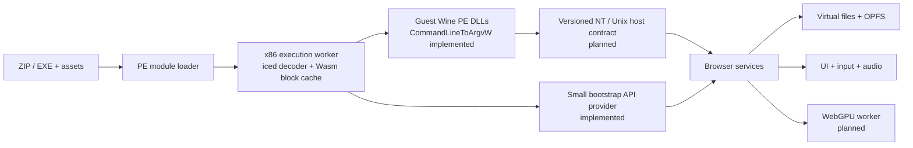

# Architecture: executing more Windows PE programs

## Scope and current state

WineBrowser is an experimental x86 PE32 runner. It maps an executable and its DLL dependency graph into a bounded guest
address space, decodes x86 instructions with iced-x86, and emits WebAssembly for basic blocks as
they execute. The CPU and PE loader live in [`src/cpu.js`](../src/cpu.js) and
[`src/pe.js`](../src/pe.js); [`src/runtime.js`](../src/runtime.js) resolves a small set of
imported Win32 functions to JavaScript host services. The worker owns execution; the page
handles dialogs, audio activation, and output in [`src/worker.js`](../src/worker.js) and
[`src/main.js`](../src/main.js).

This is a direct, dynamic translation path. It does not contain Theseus or pretranslated game
images. It accepts PE32 executables and DLLs with imports, named/ordinal/forwarded exports,
HIGHLOW relocation, static TLS for one guest thread, and guest initialization/callbacks. Delay-import directories remain unsupported. Wine's unchanged CommandLineToArgvW body now executes as a guest DLL; it is a
single extracted component, not a full Wine runtime. It is not a Wine implementation and does not claim general Windows
compatibility.

The immediate goal should be controlled support for more ordinary PE programs while keeping
guest-visible behavior explicit. Expand support behind tests for representative binaries and
APIs; every feature needs a tested boundary and a useful failure when absent.

## Reuse choices

**Guest PE DLLs** now load as guest modules. Their machine code remains x86 and
executes on the same guest CPU as the EXE. The loader maps sections, applies relocations, resolves imports/exports and runs initialization
callbacks. Module identity is preserved. FreeLibrary balances explicit LoadLibrary references and
unloads unreachable dynamic dependency closures with TLS/DllMain detach and mapping cleanup.
Startup imports and process roots stay resident; full Windows loader locking and concurrent
load/unload semantics still need work. A DLL's exports are guest addresses, not JavaScript functions. This approach
preserves the executable's expected calling conventions and lets DLL-to-DLL calls remain
ordinary guest calls, but it depends on a loader and CPU capable of the code those DLLs contain.

**Portable C libraries compiled to WebAssembly** are different. They can implement host-side
services such as a codec, a shader translator, or a carefully isolated compatibility helper.
Their C ABI crosses a host boundary; it does not make an x86 Windows DLL loadable. A wrapper
must marshal values and buffers between guest memory and the library, map errors and lifetime
rules, and avoid leaking host pointers into guest state. Compile only components with understood
browser-compatible dependencies and licenses.

For either implementation, guest callbacks must use the guest's x86 execution path. An imported
service that receives a callback address needs a trampoline that saves guest CPU state, enters
the same dispatcher at that guest address with the correct stack and calling convention, then
resumes the host operation with the guest return value. Calling a host Wasm function directly
with a guest address or assuming the host's native ABI matches stdcall is incorrect. Re-entry
through an asynchronous browser prompt needs explicit suspension/resumption rules as well.

## NT and Unix host boundary

Wine separates Windows-facing PE DLLs from Unix-side implementations through defined Unix
library calls. WineD3D itself has internal adapter/resource/shader interfaces, but its build
also depends on Unix-side integration and graphics backends; those interfaces are seams to
study, not a ready-made browser core. See the pinned [WineD3D
build](https://github.com/wine-mirror/wine/blob/bd0f453b7bb4e16c3b4ef271b3df499c34fbe848/dlls/wined3d/Makefile.in),
[WineD3D internal
interfaces](https://github.com/wine-mirror/wine/blob/bd0f453b7bb4e16c3b4ef271b3df499c34fbe848/dlls/wined3d/wined3d_private.h),
and [NTDLL Unix
interface](https://github.com/wine-mirror/wine/blob/bd0f453b7bb4e16c3b4ef271b3df499c34fbe848/dlls/ntdll/unixlib.h).
The [WineD3D feasibility
study](https://github.com/evangit2/DirectWebGPU/blob/2cb676dcefcfd486d06d2ad43d7754c3c7bdb9c8/docs/wined3d-feasibility.md)
audits these as candidates for selective semantic reuse, not as a transplanted compatibility
runtime.

In a browser there is no Unix host process to call. Recreate the needed host contract
deliberately: guest NT/Win32 behavior remains owned by the guest runtime; operations needing
browser capabilities go through narrow host services. Start with typed calls for virtual files,
clocks, dialogs and audio. If a native-Wasm component is introduced, give it a versioned,
pointer-safe import/export contract. If work is moved to another worker, pass IDs, offsets,
generations and bounded byte buffers rather than C pointers or GPU objects.

## Runtime state that must precede broad DLL use

DLL callbacks, thread-local storage, structured exceptions and threads are coupled to loading
and execution. Do not treat them as incidental follow-up features.

- **TLS:** `src/tls.js` allocates distinct aligned module buffers and publishes their index vector at TEB+0x2c. It copies initialized data after relocation, zeroes the tail, and invokes process callbacks before DLL entry points and before the main EXE entry. All mapped templates exist before the first callback. Dynamic DLL loads allocate new slots; failed loads release only newly allocated TLS state. Limits are 128 modules/callbacks and 1 MiB data per module. Guest threads, thread notifications and dynamic TlsAlloc/TlsGetValue slots remain unsupported. The native Wine reference run and browser fixture both emit `TLS events:12349678`: DLL detach callbacks run before DllMain, and the EXE receives no TLS process-detach notification. See `evidence/tls-native-wine.json`.
- **SEH:** 32-bit Windows code commonly uses the FS-based TEB and exception registration chain.
  Correct delivery needs guest FS/TEB state, exception records, dispatcher behavior and
  unwinding; returning a JavaScript error is not equivalent to a Windows exception.
- **Threads:** each guest thread needs its own registers, stack, TEB, TLS, last-error state,
  wait state and scheduler lifecycle. Synchronization objects and callbacks must have
  guest-visible ordering. Browser workers alone do not supply Windows thread semantics.
- **Callbacks:** enumerate, window, timer and I/O callbacks can re-enter guest code while an API
  call is active. Define which thread runs them and how guest state is saved before exposing
  those APIs.

Until these mechanisms exist, reject unsupported PE features and imports early. A DLL that
happens not to exercise a TLS callback is not evidence the loader supports TLS.

## Graphics and audio services

The current GDI host provider exposes a 640×480 virtual desktop with DC/brush handles, clipped solid fills, selected brushes, four PatBlt raster operations and pixel reads/writes. A checked RGBA frame crosses the worker boundary at dispatcher yields, before blocking host requests and at exit; the test bench presents it on Canvas2D. This is a narrow raster backend, not general User32/GDI: windows, fonts, regions, DIBs and message pumps remain absent. Its handle and surface boundary should be reused by a Wine user driver as that integration advances.

Keep presentation separate from guest CPU state. A future graphics stack can translate guest D3D
calls into a versioned command protocol and send bounded batches to a dedicated worker that owns
WebGPU objects. The UI thread owns DOM and user activation; workers exchange handles and data,
never `GPUDevice` objects or guest pointers. Device loss, resource generations, fences, readback
and guest-visible reset behavior need explicit semantics. This is a separate subsystem and is
not implemented by the current PE runner.

Map audio APIs at their guest-visible boundary. WASAPI and `winmm` calls need service adapters
for device selection, format negotiation, buffers, callbacks, timing, pause/stop and errors.
Browser audio can use Web Audio after user activation, with queueing/resampling and bounded
latency; it cannot promise bit-identical timing or availability. Keep audio callbacks on the
guest CPU when Windows passes a guest function pointer. The current `Beep` demo bridge is only a
short tone request. The WinMM adapter additionally supports synchronous filename `PlaySoundA/W` for 8/16-bit mono/stereo PCM WAV, backed by real WebAudio buffer playback. It returns failure on unavailable audio or missing/invalid files and rejects unsupported flags. It does not implement aliases, resource sounds, async voice lifetime, waveOut or WASAPI.

## Milestones and risks

1. Keep the current bootstrap programs green and record PE hashes, imports, instruction
   requirements and expected outputs.
2. Guest DLL mapping, imports/exports, relocations, callbacks and attach/detach are implemented and tested. Failed dynamic loads roll back new mappings and successful dependency attaches; forwarded GetProcAddress maps/initializes its target before returning an address. FreeLibrary unloads unreferenced dynamic closures and supports later reloads. Startup roots remain resident; Windows loader locking and concurrent unload semantics remain future work.
3. Specify per-thread CPU/TEB state and implement one thread/TLS/SEH behavior at a time with
   small Windows-built fixtures. Do not admit binaries that depend on unimplemented cases.
4. Add one versioned browser service at a time. Treat graphics and sustained audio as their own
   acceptance tracks, with working files and dialog behavior as separate tests.
5. Make Wine reuse the default for broad API growth: first audit a pinned minimal Wine PE DLL
   and its NT/Unix dependencies, then build and measure that pilot before extending custom Win32
   handlers. Use portable native-Wasm libraries where the guest DLL route is unsuitable. The D3D-focused [DirectWebGPU
   study](https://github.com/evangit2/DirectWebGPU/blob/2cb676dcefcfd486d06d2ad43d7754c3c7bdb9c8/docs/wined3d-feasibility.md)
   is a research input, not a compatibility guarantee for this project.

These are investigation steps, not a promise of quick conversion. General Win32, D3D8/9, audio,
installer or commercial-game support requires substantially more execution, loader and API
coverage than the present prototypes.

## Selected long-term topology

Keep the bootstrap API surface bounded. The first Wine experiment pins Wine 11.0, retains and builds its unchanged CommandLineToArgvW implementation into a small guest PE DLL, and executes that code for independent programs. The next experiment should integrate a whole small Wine module or a coherent NT host boundary, capture its import closure and executed CPU features, and prove its behavior through the browser contract.
A failed spike must identify the missing dependency or semantic boundary before choosing an
alternative. Do not add dozens of independent Win32 replacements to avoid that evaluation.

Hot-block optimization can follow measured execution: retain an interpreter or conservative
lowering for cold code, cache compiled blocks by executable hash plus CPU/ABI version, and batch
compilation only when startup measurements justify it. Current caches live only in a worker;
OPFS currently stores package bytes and outputs, not reusable Wasm code. Compile latency and
first decoder download need separate measurements from execution time. Rust itself does not
need to compile inside the browser: the existing Rust decoder is prebuilt, and the runtime emits
Wasm binary instructions directly.

Chromium exposes WebGPU, not desktop OpenGL or Vulkan. GDI can target a canvas/surface service;
OpenGL requires an evaluated translation layer or software renderer, and WineD3D needs a real
WebGPU backend. DXVK's Vulkan output is not automatically usable. SharedArrayBuffer and Atomics
can carry bounded command/input queues once guest thread semantics exist; they are capability
probes only in this release. Drivers, kernel anti-cheat, and unrestricted OS/device access remain
outside a browser user-mode compatibility runtime even after substantial API growth.

API contracts used for these bounded backends: Microsoft [GDI](https://learn.microsoft.com/en-us/windows/win32/api/_gdi/), [PlaySound](<https://learn.microsoft.com/en-us/previous-versions/dd743680(v=vs.85)>), and [RIFF/WAVE](https://learn.microsoft.com/en-us/windows/win32/xaudio2/resource-interchange-file-format--riff-).

## Whole Wine module experiment

The optional installed-Wine probe goes beyond the extracted parser: it relocates and initializes an unmodified Wine 11 i386 `ntdll.dll` (SHA-256 `bac6f2d9434860d09a696dcdcd5f85631e19fd4f9409b3a39828841b7a40c089`) using the same module graph and guest dispatcher. Selected `RtlComputeCrc32`, `strlen`, `RtlCompareMemory` and `RtlNtStatusToDosError` cases execute in Wasm; Chromium also runs the CRC call through winapiexec uploaded with the DLL. Supporting valid LOCK read/modify/write instructions required an explicit single-thread rule: guest memory cannot be shared, and a Wasm block cannot yield between the read and write. This is not a multithreaded atomic implementation. PAUSE is accepted; Register BT/BTS/BTR/BTC operations are supported; memory bit strings, XADD and REP string operations still need work.

The Wine i386 dispatcher is installed through the exported writable `__wine_syscall_dispatcher` pointer. The bridge validates the executable wrapper/trampoline layout and derives service IDs and argument counts from those wrappers; ordinary Windows ntdll does not opt into this Wine-specific ABI. EAX selects the service, arguments begin at ESP+8, and the bridge removes only its own return address so the guest wrapper performs its normal stack cleanup. The alternate `CALL FS:[0xc0]` wrapper form uses the same service table and stack layout; positively identified Wine images also receive the dispatcher pointer in TEB.WOW32Reserved. Both slots are cleared on failed-load rollback. No guest code bytes are patched. Unknown services fail explicitly.

Implemented services include `NtQueryInformationProcess(ProcessWow64Information)`, which reports the actual native PE32 execution model (no WOW64 companion PEB), `NtQuerySystemTime`, `NtQueryPerformanceCounter`, `NtAllocateVirtualMemory` and `NtFreeVirtualMemory`. Clocks use real wall/monotonic time. Virtual memory is bounded to a 14 MiB allocation arena inside the existing guest address space, checks collisions with complete DLL image reservations, and supports reserve/commit/decommit/release plus no-access/read-only/read-write protections. A null-base commit reserves implicitly; a combined reserve/commit covers the entire rounded allocation. Recommit after decommit zeroes storage; committing already committed pages preserves bytes. Checked guest accesses may span adjacent permitted pages, and fail across a protected page. Executable allocations, remote-process handles, nonzero ZeroBits constraints and partial releases are outside this subset.

`src/simd.js` holds eight XMM registers and implements MOVD/MOVQ/MOVDDUP, aligned/unaligned 128-bit moves, low-lane unpack, PXOR and PSHUFD. It checks complete memory ranges before vector stores, enforces legacy alignment rules, and preserves flags. Guest callback boundaries save and restore XMM state alongside scalar registers. BSF/BSR cover 16/32-bit register and memory sources. CMPXCHG supports byte/word/dword registers and checked memory destinations, including LOCK under the same single-thread restriction. Failed comparisons still require writable memory and update the accumulator and subtraction flags. Floating-point arithmetic and broader SIMD remain unsupported.

`src/wine-process.js` follows Wine’s [loader bootstrap ordering](https://github.com/wine-mirror/wine/blob/db11d0fe6a169c457e23d007e20404643d067aa8/dlls/ntdll/loader.c): call the guest RtlCreateHeap with HEAP_GROWABLE, publish PEB.ProcessHeap, then run DLL attach. The first heap remains Wine’s process heap; a separate private heap tests destruction. PEB.NumberOfProcessors and TEB.ClientId describe one guest thread. Kernel32 GetProcessHeap returns the Wine handle after bootstrap, and HeapAlloc/HeapFree dispatch to guest Rtl functions; allocations made earlier with the bootstrap host handle retain their original allocator. Bootstrap failure restores DLL data and releases newly reserved heap pages. This is a limited process-initialization slice; loader lists, thread-local Windows services, locks requiring kernel objects and full CRT startup remain outstanding.

`src/wine-parameters.js` then calls the same guest DLL's
`RtlInitializeCriticalSectionEx` and `RtlCreateProcessParametersEx`, publishing
`PEB.FastPebLock` and `PEB.ProcessParameters` before DLL attach. Arguments share
the existing command-line quoting rules; image/current-directory paths remain
relative to the virtual package. Stdout/stderr match the browser console provider;
stdin remains unavailable. `RtlCreateEnvironment` and `RtlSetCurrentEnvironment`
install an independently allocated empty environment, following Wine's ownership
rule so later variable changes may safely resize/free it. Host environment
variables are never copied. Parameter-construction scratch buffers are released,
and initialization/attach failure restores the published PEB pointers along with the
new native heap reservations. Guest tests verify recursive locking, command-line
quoting, missing variables, case-insensitive lookup and environment growth/deletion.
This does not implement guest threads or contention through kernel wait objects.
With supplied NLS data, `src/wine-nls-process.js` maps the real CP1252/CP437/case
tables and calls guest `RtlInitNlsTables` and `RtlResetRtlTranslations`. Its owned
views and PEB pointers also roll back on failed startup. See [NLS scope](wine-nls.md).

The NT registry adapter (`src/wine-registry.js`) implements create/open/set/query
and registry-handle close over the same nodes, quotas and access masks as the
Advapi32 provider. Native creation requires an existing parent; native relative
paths require an opened handle rather than a Win32 HKEY pseudo root. Value
queries currently support `KeyValuePartialInformation`, including size probes and
bounded partial copies. Unsupported attributes, create options and query classes
return errors. The initial store includes the parent keys normally supplied by a
Wine registry prefix; it invents no successful locale-value queries.

`NtQueryInformationToken(TokenUser)` exposes one isolated guest user for the
process/effective-token pseudo handles. Its PE32 `TOKEN_USER` points into the
caller's own buffer. HKCU aliases that user's node under HKU, so native Wine and
Advapi32 see the same values. This identity is synthetic and never derived from
the host account. A thread impersonation token is absent; other token information
classes and real token handles remain unsupported. No host security boundary or
authentication operation is represented by these guest identity bytes. The virtual
process uses UTC with no daylight-saving rules; timezone queries do not inspect
the host timezone. Basic system information reports the actual guest memory size,
page/allocation granularity, address bounds and single processor rather than host
machine resources.

Host imports can declare `convention: 'cdecl'` in their response; the runtime
pops the return address and leaves arguments for the caller. The default remains
stdcall. Wine's NT dispatcher retains its own validated wrapper convention.
Unknown conventions fail explicitly. SIMD coverage includes SSE2
`PEXTRW r32, xmm, imm8`, including lane masking and zero-extension, which Wine's
parameter-building string routines execute. SSE2 PADDW supplies wrapping word-lane addition, and scalar BSWAP uses direct Wasm lowering. Unsupported MMX/SSE4.1 variants still fail explicitly.

The Node probe checks five simultaneous allocations from 32 to 200,000 bytes, zeroing, independent contents, freeing, private-heap page release, and Kernel32/legacy-heap routing. The Chromium probe observes 32 zeroed bytes written from a real Wine heap allocation, successful free, and private-heap destruction with NT page release. Registry handles can now be closed through NtClose; other NT handle/object services remain absent. Wine’s pinned [NT syscall declarations](https://github.com/wine-mirror/wine/blob/db11d0fe6a169c457e23d007e20404643d067aa8/dlls/ntdll/ntdll.spec), [i386 dispatcher](https://github.com/wine-mirror/wine/blob/db11d0fe6a169c457e23d007e20404643d067aa8/dlls/ntdll/unix/signal_i386.c), [virtual-memory implementation](https://github.com/wine-mirror/wine/blob/db11d0fe6a169c457e23d007e20404643d067aa8/dlls/ntdll/unix/virtual.c) and [server protocol](https://github.com/wine-mirror/wine/blob/db11d0fe6a169c457e23d007e20404643d067aa8/dlls/ntdll/unix/server.c) define the integration boundary. Portable native fixtures exercise the same dispatcher ABI in CI without redistributing an installed Wine binary.

A whole msvcrt integration is relevant to 7zr, but its installed Wine closure includes kernel32, kernelbase and ntdll. Mapping that closure (approximately 4.3 MiB for the inspected build) is feasible; its normal startup now executes through the architecture query and memory allocations through the NLS mapping calls when supplied with verified data, before further NT services needed by locale initialization. The optional `scripts/probe-wine-crt.mjs` pins all four DLLs and records pre-rollback module state and the exact failure. Kernelbase locale initialization requires real Wine locale/geo, sorting and normalization data mappings; a success stub would immediately yield invalid guest pointers. Process parameters now initialize through Wine exports; further NT and loader services remain prerequisites. The OpenGL32 closure additionally needs User32, GDI and Win32u/Unix driver integration. A small module image or a low import count does not make those services browser-compatible.
